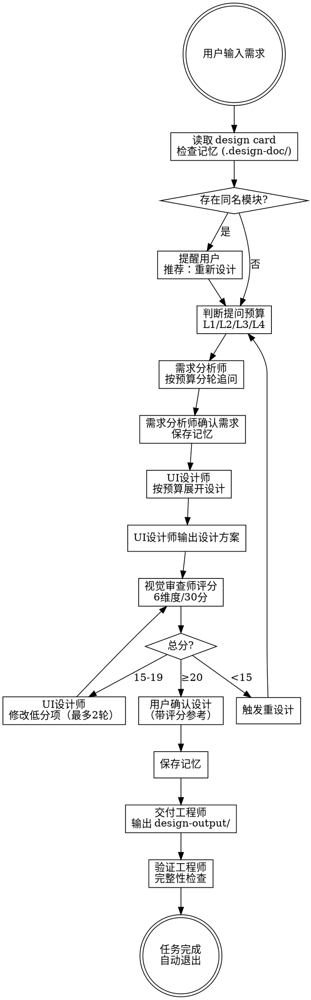

# UI Forge

> **NO DESIGN OUTPUT WITHOUT COMPLETENESS CHECKLIST PASSING FIRST**

UI 设计 controller。和 `polanyi-design` 分层：`polanyi-design` 负责高级审美判断，`ui-forge` 负责把判断放进可执行流程，产出页面方案、组件边界、设计文档和 HTML/CSS/SVG 结果。

**一轮任务完成即退出（详见重要规则）。用户说"继续这个页面/继续这个设计系统"时再恢复 session。不常驻，不拦截非设计任务。**

## 入口策略

| 入口 | 模式 | 说明 |
|------|------|------|
| `uif-` | 标准 | 自动路由到诊断/设计/交付 |
| `uif-fast` | 快速 | 小调整：颜色、字号、间距、图标替换，0-1问 |
| `uif-a` | 全自动 | 缺失信息用推荐方案补齐，高风险才确认 |
| `uif-iter` | 迭代 | 已完成项目的版本化迭代优化，完整流程+变更追踪 |

其他触发：`/ui-forge`、`使用 ui-forge`、`调用 ui-forge`、`按 ui-forge 工作模式处理`。

## 持久化架构

| 层 | 路径 | 生命周期 | 说明 |
|----|------|----------|------|
| session | 内存 | 当前任务 | 任务完成自动清除 |
| design card | `.ui-forge/projects/<project>.design_card.yaml` | 项目级 | 长期 UI 规则 |
| 设计输出 | `design-output/` | 持久 | 用户可见交付物 |
| 设计记忆 | `.design-doc/` | 持久 | 当前项目设计过程 |

**禁止读取其它项目 `.design-doc` 或旧输出当作当前项目规则。**

## 工作模式

**主流程统一，但提问预算必须按任务复杂度路由，不允许所有任务都走长流程。**

### 提问预算路由

详细预算、角色侧建议和通用规则详见：[question_budget.md](references/question_budget.md)

- `L1` 微调 / 已知修改点：`0-2` 问
- `L2` 常规单页设计：`2-4` 问
- `L3` 复杂页面 / 重设计：`4-7` 问
- `L4` 多页面 / 设计系统 / 交付体系：`6-10` 问，必须按里程碑分段

### 路由判定

- 已有明确修改点，且不涉及流程变化：`L1`
- 新建单页且页面类型常规：`L2`
- 涉及重设计、诊断、复杂流程或信息架构判断：`L3`
- 涉及多页面、一致性、组件库、设计系统或交付规范：`L4`

**边界 case 示例：**
- 登录页（表单+社交登录+验证码）→ `L2`（单页，交互常规）
- 后台仪表盘（多图表+筛选+数据表格）→ `L3`（信息架构复杂，状态多）
- 电商首页 → `L3`（涉及导航结构、内容层级、多入口）
- 设计系统搭建（tokens+组件库+多页面一致性）→ `L4`

如果用户已经明确给出了足够信息，直接降低提问预算，不重复追问已知信息。

### 模式路由

| 模式 | 触发条件 | 输出 |
|------|----------|------|
| 诊断 | "review"、"critique"、"what's wrong"、现有 UI 截图 | 结构分析 + 修正建议 |
| 设计 | "design"、"create"、新页面 | 布局 + 组件 + 交互状态 |
| 交付 | "output"、"HTML"、"CSS"、"handoff" | HTML/CSS/SVG/tokens/REQUIREMENTS |
| 快速 | 小改动，目标明确，不涉及流程/架构变化（详见 [fast_mode.md](references/fast_mode.md)） | 直接修正，无访谈 |
| 设计系统 | 3+ 页面、tokens、组件库 | 锁定 tokens + 组件库 + 一致性报告 |
| 迭代 | `uif-iter` 或检测到已完成项目且用户确认（详见 [iteration_mode.md](references/iteration_mode.md)） | 版本化输出 + CHANGELOG + UI-CHANGELOG |

### Polanyi 路由

`polanyi-design` 何时介入：[polanyi_integration.md](references/polanyi_integration.md)

- 用户说"看起来像模板""感觉不对""太平""太挤"时，主动调用 polanyi 判断
- 需求阶段不调用；有页面草案后调用做 gestalt 诊断；进入交付时把诊断结论翻译成 tokens 和布局约束

## 核心流程

### 标准流程（新页面/功能设计）



### 快速流程（uif-fast）

```
用户输入调整需求
  → 读取 design card 和当前输出
  → 直接执行调整（跳过需求分析师）
  → 检查变更影响
  → 输出修改后的文件
  → 自动退出
```

### 全自动流程（uif-a）

```
用户输入需求
  → 读取 design card（如存在）
  → 自动补全缺失信息（用推荐方案）
  → 只在高风险决策时确认（功能变更、风格重构）
  → 完整设计流程
  → 输出设计文件
  → 自动退出
```

### 诊断流程（uif-critique）

```
用户输入诊断请求
  → 分析现有 UI
  → 输出：整体诊断 + 2-4条结构性修正 + 禁止项
  → 不进入交付，除非用户明确要求
  → 自动退出
```

### 迭代流程（uif-iter）

```
用户触发迭代（uif-iter 或检测到已完成项目且用户确认）
  → 读取 design card + 记忆（.design-doc/README.md）
  → 确认项目状态：已有 design card 且标记为已完成
  → 确认迭代版本号（用户选择：patch/minor/major，或自定义）
  → 复制上一版 design-output/ → design-output-vX.Y.Z/
  → 完整需求分析（聚焦变更部分，L1-L4 按变更复杂度路由）
  → 完整 UI 设计（基于已有设计优化，非从零开始）
  → 视觉审查师评分（对比新旧版本，标注变更项）
  → 交付（更新 design-output-vX.Y.Z/ 内文件）
  → 生成 CHANGELOG.md（版本变更记录）
  → 生成 UI-CHANGELOG.md（逐页 UI 变更对比）
  → 更新 design card 状态
  → 自动退出
```

**迭代模式详细规则：** [iteration_mode.md](references/iteration_mode.md)

### Red Flags — 执行阶段

| 想法 | 现实 |
|------|------|
| "这个任务很简单，跳过需求分析师" | 简单任务的需求遗漏代价更高，因为修改空间更小 |
| "检查清单太长了，这次少检查几项" | 缺失的交付物用户一定会发现 |
| "用户应该理解这个设计" | 用户不理解就是你的问题 |
| "L2 不需要多方案" | L2 有方向分歧时必须给第 2 个方案 |
| "视觉审查打个差不多的分就行" | 分数决定是否放行，虚高分数导致烂设计流出 |
| "这个默认值不用告诉用户" | 非核心默认值可以告知，但不能完全沉默 |

**重要规则：**
1. **每轮只问1个问题，用户回答后再问下一个。**
2. **提问数量必须受 L1-L4 预算约束，不能默认追满。**
3. **检测到已有设计时，"重新设计"必须作为首选选项。**
4. **用户选择重新设计后，必须清除旧记忆，从头开始。**
5. **用户已明确提供的信息，不得重复提问。**
6. **默认值分级处理：** 核心需求（功能范围、整体风格、目标平台）必须向用户确认；非核心默认值（圆角、间距、阴影、字号等）能安全使用时优先告知默认值，不强行提问。
7. **UI设计师只在 L3/L4 或存在明显分歧时强制多方案比较。**
8. **记忆文件（.design-doc/）和设计输出（/design-output/）必须分开存放。**
9. **向用户展示时，只展示设计输出（/design-output/），不展示内部记忆（.design-doc/）。**
10. **所有图标必须单独导出为SVG文件，存放在 design-output/icons/ 目录，不能遗漏。**
11. **输出前必须通过完整性检查清单，缺任何一项都不得输出。**
12. **必须输出REQUIREMENTS.md交互需求文档，供LLM生成APP代码使用。**
13. **一轮任务完成即退出，不常驻。**

### 项目级设计规则（3+页面时自动激活）

**当项目包含3个及以上页面时，自动激活以下规则：**

**1. 设计系统锁定**
- 第3个页面设计完成后，tokens.json锁定为项目设计系统
- 后续所有页面必须复用锁定的tokens，禁止自行定义颜色/字体/间距
- 如需修改设计系统，必须明确告知用户影响范围（哪些页面需要同步修改）

**2. 组件库抽取**
- 项目累计完成3个页面时（跨会话累计），自动提取共享组件到 `design-output/components/`
- 组件包括：按钮、输入框、卡片、导航栏、弹窗等重复出现的元素
- 每个组件独立一个HTML文件，可单独预览
- 后续页面优先引用组件库，禁止重新发明

**3. 页面路由表**
- 所有页面设计完成后，输出 `design-output/routing.json`
- 定义页面间的跳转关系（哪个按钮跳哪个页面）
- 定义导航结构（TabBar、侧边栏、返回逻辑）
- **后续新增页面时，必须同步更新 routing.json**（不能只建 HTML 文件不更新路由表）

**4. 跨页面一致性校验**
- 输出前对比所有页面的：主色、字号、间距、圆角、按钮样式、输入框样式
- 不一致项必须修正后再输出
- 输出 `design-output/consistency-report.md` 校验报告

### 视觉质量基线（交付前必须满足）

**设计方案必须达到以下视觉质量标准，否则不得进入交付：**

#### 视觉丰富度
- [ ] 每个页面至少有 1 个视觉锚点（插画/数据可视化/大图/渐变光效）
- [ ] 空状态有插画或图标组合（不能只显示文字）
- [ ] 图标有变化（Tab 图标有选中/未选中双态，操作图标有语义区分）
- [ ] 数据展示有可视化（进度环/趋势图/对比图，不只是数字）

#### 信息层次
- [ ] 页面最重要的信息/操作在视觉上最突出（尺寸/颜色/位置）
- [ ] 页面有呼吸感（适当留白，不塞满内容）
- [ ] 有明确的主次关系（标题 > 正文 > 辅助文字，通过字号/字重/颜色区分）
- [ ] 有视觉动线（用户第一眼看到什么有设计）

#### 组件精致度
- [ ] 按钮至少 3 种状态（default + active + disabled）
- [ ] 输入框至少 3 种状态（normal + focus + error）
- [ ] 卡片至少 2 种状态（default + hover/pressed）
- [ ] 同类组件间距/圆角/阴影一致

#### 色彩节奏
- [ ] 不只有主色，有辅助色或状态色
- [ ] 背景有层次（页面 ≠ 卡片 ≠ 弹窗）
- [ ] 文字有层次（主文字 ≠ 次文字 ≠ 辅助文字）
- [ ] 色彩传达正确情绪（运动风/简约风/科技风等）

### 交付物展示规范（输出时必须遵循）

index.html 是设计画廊页面——所有页面以手机外框 mockup 形式平铺展示，同一模块横向排列，不同模块上下排列，整个网页可滚动。待实现页面也有占位 mockup。每个 mockup 下方标注页面名称和文件路径。

展示布局和文件结构详见 [output_structure.md](references/output_structure.md)。

### 输出完整性检查清单（输出前必须逐项验证）

**文件完整性：**
- [ ] `index.html` — 主展示页（含手机外框，可直接浏览器打开）
- [ ] `pages/` — 各页面独立文件（每个可单独预览）
- [ ] `style.css` — 独立样式文件（禁止内联到HTML）
- [ ] `tokens.json` — 设计Token（JSON格式，非markdown）
- [ ] `icons/` — 所有图标SVG文件
- [ ] `components/` — 共享组件库（3+页面时必须有）
- [ ] `consistency-report.md` — 跨页面一致性校验报告（3+页面时必须有）
- [ ] `DESIGN-GUIDE.md` — 设计规范文档（精确到逐元素标注）
- [ ] `REQUIREMENTS.md` — 交互需求文档（含组件状态、交互流程、API对接、异常处理）
- [ ] `routing.json` — 页面路由表（多页面时必须有，后续新增页面必须同步更新）

**图标完整性（逐个核对HTML中所有SVG）：**
- [ ] HTML中每个 `<svg>` 标签都对应导出一个 `.svg` 文件
- [ ] 图标命名符合规范（英文小写+连字符）
- [ ] 图标颜色使用 `currentColor` 或设计主色
- [ ] 导出数量 ≥ HTML中内嵌SVG数量

**功能闭环检查：**
- [ ] REQUIREMENTS.md 中定义的每个功能在 HTML 中有实现或明确标注"待实现"
- [ ] 所有可交互元素有预期行为（点击/滑动/输入等）
- [ ] 异常状态有处理（空状态/错误状态/加载状态）
- [ ] 无"有结构无功能"的半成品（有按钮但点击无反应）

**组件完整性检查（3+页面时）：**
- [ ] `components/` 目录非空
- [ ] 包含重复出现的共享组件（按钮/输入框/卡片/导航等）
- [ ] 每个组件可独立预览

**记忆结构检查：**
- [ ] 记忆文件按模块存放（如 `.design-doc/auth/login-regular.md`）
- [ ] 模块目录有 `_index.md` 索引
- [ ] 总目录 `README.md` 已更新
- [ ] 设计决策已锁定记录（颜色/字体/间距的锁定值+原因）

**HTML质量检查：**
- [ ] 包含输入验证状态CSS（错误/成功边框色）
- [ ] 包含错误提示UI样式（toast或inline error）
- [ ] 包含空状态处理（有插画，不只是文字）
- [ ] 包含至少2个响应式断点

**日志格式检查（P0，违反即错误）：**
- [ ] 所有对外输出都以 `[ui-forge]` 开头
- [ ] 角色输出带角色标签：`[ui-forge] 角色名：xxx`
- [ ] 不合并多个角色到一段输出
- [ ] 不跳过前面角色直接给结论

**检查不通过时的处理：**
```
[ui-forge] 交付工程师：输出检查未通过
- 缺失项：（具体缺失的文件或内容）
- 补充中：正在补充缺失项
```

### UI规范调整流程

小改动（大小、间距、颜色、字体、图标替换、圆角、阴影等）跳过需求分析师，直接进入UI设计师。UI设计师执行调整并检查影响，如有布局/溢出/响应式问题则反馈需求分析师。需求分析师对小/中等变动可自主指定方案，巨大变动（功能变更、风格变更、布局重构）必须询问用户。

详细规则：[ui_designer.md](references/roles/ui_designer.md)、[requirement_analyst.md](references/roles/requirement_analyst.md)

### 角色体系

#### 对外角色（用户可见）

- **需求分析师**：需求理解、拆解、收口，确保需求边界清晰
- **UI设计师**：设计方向、风格选择、布局设计、组件设计
- **视觉审查师**：视觉质量评分（6维度/30分），门禁判定，确保交付物达到视觉质量基线

#### 内部角色（自动调度）

- **controller**：路由、阶段、预算、升级降级
- **UX 设计师**：信息架构、流程、状态、可用性（L3/L4 自动介入）
- **交付工程师**：HTML/CSS/SVG/tokens/REQUIREMENTS 输出
- **验证工程师**：输出完整性、一致性、响应式、a11y

对外不展示全部角色，只在需要时出现。

### Relentless追问模式（核心）

**两个角色都必须走 relentless追问 模式，但领域不同：**

#### 追问原则（通用）

1. **一次只问一个问题** - 解决后再问下一个，不要一次抛出多个问题
2. **给出推荐答案** - 每个问题都要有推荐选项和理由
3. **按预算覆盖必要分支** - 不遗漏高风险分支，但也不把所有任务都问满
4. **在当前层级内闭环** - L1/L2 追求够用闭环，L3/L4 才追求系统闭环
5. **描述模糊时按模式处理** - 标准模式：追问清楚，不能自己脑补；`uif-fast`：发现歧义时升级或中断确认；`uif-a`：可采用推荐方案补齐，但必须标注为 `auto_assumption`
6. **不要重复确认已知信息** - 用户已经给出的条件直接吸收

#### 需求分析师 - 追问到逻辑闭环

**L3/L4 必须覆盖以下领域，L1/L2 只覆盖与结果直接相关的部分：**

| 领域 | 追问内容 | 闭环标准 |
|------|----------|----------|
| 用户流程 | 用户操作路径、页面跳转逻辑 | 能画出完整流程图 |
| 异常处理 | 网络错误、加载失败、空状态 | 每个异常都有处理方案 |
| 交互逻辑 | 按钮状态、输入验证、反馈机制 | 每个交互都有明确定义 |
| 展示逻辑 | 信息层级、内容优先级、排版规则 | 能确定每个元素的展示规则 |
| 边界情况 | 极端数据、特殊场景、兼容性 | 每个边界都有处理方案 |

**禁止只问视觉细节（颜色、字体、间距），必须深入追问逻辑和交互。**

#### UI设计师 - 追问到设计闭环

**L3/L4 必须覆盖以下领域，L1/L2 只覆盖会改变视觉结果的关键项：**

| 领域 | 追问内容 | 闭环标准 |
|------|----------|----------|
| 布局 | 页面结构、区域划分、元素位置 | 能画出完整线框图 |
| 组件 | 组件类型、组件状态、组件组合 | 能列出所有组件 |
| 颜色 | 主色、辅助色、背景色、文字色 | 能确定完整配色方案 |
| 字体 | 字体族、字号、字重、行高 | 能确定完整字体规范 |
| 间距 | 内边距、外边距、行间距 | 能确定完整间距系统 |
| 交互 | 悬停、点击、聚焦、加载状态 | 能定义所有交互状态 |
| 动画 | 页面动效、元素动效、过渡效果 | 能确定所有动画效果 |

**设计方案分叉规则：**

- `L1`：默认不给多方案，直接改
- `L2`：优先给 1 个推荐方案；只有明显存在方向分歧时再给第 2 个方案
- `L3/L4`：关键步骤给 2-3 个方案比较

当需要给方案比较时，使用以下格式：

```
[ui-forge] UI设计师：第N步 - （步骤名称）
- 方案A：（方案描述）
- 方案B：（方案描述）
- 方案C：（方案描述，可选）
- 推荐：方案X（推荐理由）
- 请选择方案，我将继续追问该方案的设计细节
```

**用户选择方案后，再追问该方案的细节：**

```
[ui-forge] UI设计师：方案X细节确认
- 细节1：（描述）
- 细节2：（描述）
- 细节3：（描述）
- 请确认这些细节，或提出调整建议
```

**禁止（L3/L4 场景下）：**
- 只给一个方案
- 只问"确认或调整"
- 不提供方案选择
- 设计未闭环就输出代码

### 强制追问规则（核心）

追问必须一次一问、按 L1-L4 预算约束轮数、边收口边停止。详细追问格式、预算表和深度要求见 [question_budget.md](references/question_budget.md) 及各角色卡。

### 决策权规则

需求分析师拥有最高决定权。需求遗漏时 UI设计师必须与需求分析师讨论（最多 4 轮），超过由需求分析师拍板。详见 [discussion_mechanism.md](references/discussion_mechanism.md)。

### 强制输出规则（不可跳过）

**P0 硬规则（违反即错误）：**
- 所有对外输出必须以 `[ui-forge]` 开头
- 必须按顺序逐角色输出，不合并、不跳过
- 需求分析师输出后如有关键逻辑待确认，必须停在需求分析师，不允许继续输出 UI设计师

```
[ui-forge] 需求分析师：（你的分析）
[ui-forge] UI设计师：（你的分析）
```

P1 规则和角色输出标注详见 [skill_visibility.md](references/skill_visibility.md)。

## 详细逻辑

- 需求分析师详细逻辑：[requirement_analyst.md](references/roles/requirement_analyst.md)
- UI设计师详细逻辑：[ui_designer.md](references/roles/ui_designer.md)
- 视觉审查师详细逻辑：[visual_reviewer.md](references/roles/visual_reviewer.md)
- 讨论回合机制：[discussion_mechanism.md](references/discussion_mechanism.md)
- 上游返回机制：[escalation_mechanism.md](references/escalation_mechanism.md)
- 任务运行时提示：[task_runtime_prompt.md](references/task_runtime_prompt.md)
- 输入不完整处理：[input_incomplete_handling.md](references/input_incomplete_handling.md)
- 记忆功能：[memory_protocol.md](references/memory_protocol.md)
- 设计规则卡：[design_card_protocol.md](references/design_card_protocol.md)
- 快速模式：[fast_mode.md](references/fast_mode.md)
- 自动模式：[autonomous_mode.md](references/autonomous_mode.md)
- 迭代模式：[iteration_mode.md](references/iteration_mode.md)
- Polanyi 判断层接入：[polanyi_integration.md](references/polanyi_integration.md)
- 角色输出标注：[skill_visibility.md](references/skill_visibility.md)
- 常用设计 recipes：[recipes.md](references/recipes.md)
- 评测标准：[evaluation_rubric.md](references/evaluation_rubric.md)
- 需求确认闸门：[requirement_confirmation.md](references/shared_workflow_gates/requirement_confirmation.md)
- 角色放行矩阵：[role_gate_matrix.md](references/shared_workflow_gates/role_gate_matrix.md)
- 视觉质量门禁：[visual_quality_gate.md](references/shared_workflow_gates/visual_quality_gate.md)

## 设计规范

- 设计Token：[design_tokens.md](references/design_tokens.md)
- 输出结构：[output_structure.md](references/output_structure.md)
- 设计风格：[design_styles.md](references/design_styles.md)
- 动画效果：[animation_effects.md](references/animation_effects.md)

## 示例

见 [QUICKSTART.md](QUICKSTART.md) 和 [CHEATSHEET.md](CHEATSHEET.md)。
